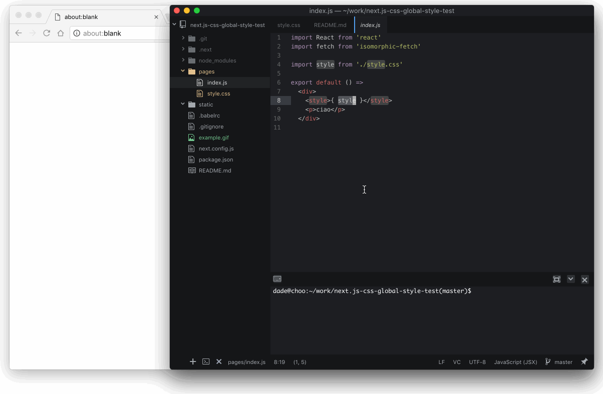

README
------

This is an example of how you can include a .css file as a global style in a next.js webapp.

### Running

To get this example running you just need to

    npm install .
    npm run dev

Visit [http://localhost:300](http://localhost:300) and try to modify `pages/style.css` changing color. Your changes should be picked up instantly.

### Explanation

The strategy here is to transpile the css file to a css-in-js file so that it can be loaded and hot reloaded both on the server and the client. For this purpose i created a babel loader plugin called [babel-loader-wrap-in-js](https://github.com/davibe/babel-plugin-wrap-in-js)

This project shows how you can set it up. Have a look at
- .babelrc
- next.config.js
- pages/style.css
- pages/index.js

Note:

I am still working in polishing up `babel-plugin-wrap-in-js` then maybe later i will take a look how to load sass/less and others
